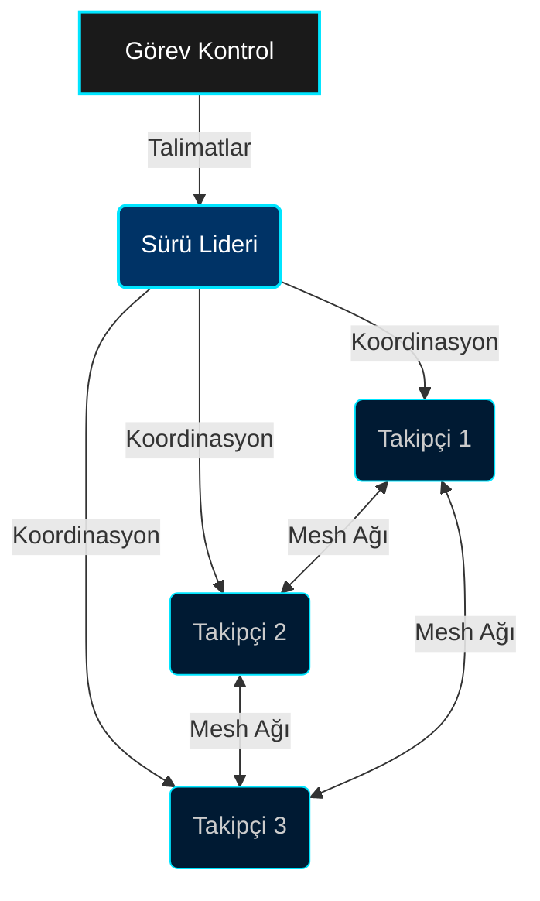
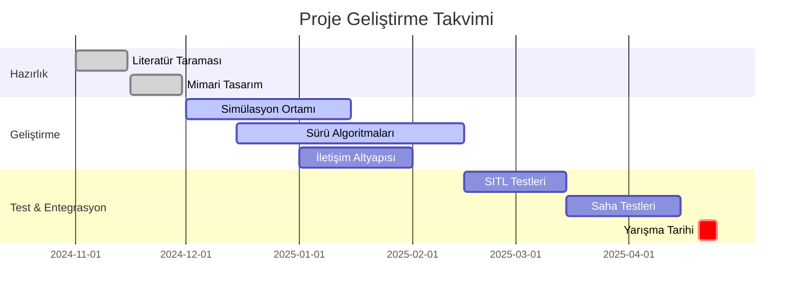

<div align="center">

# 🚁 TEKNOFEST SÜRÜ ZEKASI KOMUTA MERKEZİ
### Sürü İHA (Swarm UAV) Yarışması 2025


[](LICENSE)
[](https://github.com/bahattinyunus/teknofest_suru_iha)
[](https://docs.ros.org/en/humble/)
[](https://gazebosim.org/)
[](Dockerfile)

</div>

---

## 🌍 Küresel Sürü Zekası Ekosistemi
**"Dünyadaki Benzer Yarışmalar, Araştırma Laboratuvarları ve Açık Kaynak Projeler"**

Bu proje, küresel sürü robotatiği topluluğunun bir parçasıdır. Aşağıda, dünya çapındaki önemli kaynaklar kategorize edilerek listelenmiştir:

### 🏆 Prestijli Yarışmalar (Global Competitions)
| Yarışma / Organizasyon | Ülke / Bölge | GitHub Repo / Kaynak Kod |
| :--- | :--- | :--- |
| **MBZIRC Maritime Grand Challenge** | BAE | 🔗 [osrf/mbzirc](https://github.com/osrf/mbzirc) |
| **DARPA OFFSET (Swarm Experiment)** | ABD | 🔗 [niwcpac/mole](https://github.com/niwcpac/mole) |
| **IARC (International Aerial Robotics)** | Küresel | 🔗 [ICRS/IARC](https://github.com/ICRS/IARC) |
| **IMAV (Int. Micro Air Vehicle)** | Küresel | 🔗 [imav2022_nanocopter](https://github.com/tristandijkstra/imav2022) |
| **Swarm-UAV Competition** | Küresel | 🔗 [okantorun/Swarm-UAV](https://github.com/okantorun/Swarm-UAV) |
| **Swarm-Rescue (Search & Rescue)** | Küresel | 🔗 [ArkhamKnightGPC/drone-swarm-psc](https://github.com/ArkhamKnightGPC/drone-swarm-psc) |
| **CopterHack (Swarm-in-Blocks)** | Küresel | 🔗 [swarm-in-blocks](https://github.com/intelligent-soft-robotics/swarm-in-blocks) |

### 🔬 Akademik Araştırma Laboratuvarları (Research Labs)
| Laboratuvar / Proje | Kurum | Odak Alanı / Repo |
| :--- | :--- | :--- |
| **GRASP Lab** | UPenn | 🔗 [Multi-Robot Systems](https://github.com/grasp-irl) |
| **HeRoLab** | University of Georgia | 🔗 [heroswarmv2](https://github.com/herolab-uga/heroswarmv2) |
| **Swarm Lab** | UC Berkeley | 🔗 [Open Source Swarms](https://theswarmlab.com/) |
| **Marine Robotics Group** | MIT | 🔗 [The Thoroughbreds](https://github.com/MarineRoboticsGroup/SwarmRobot) |

### 💻 Açık Kaynak Sürü Yazılımları (Open Source Software)
| Proje İsmi | Tip | GitHub Link |
| :--- | :--- | :--- |
| **Awesome Swarm Drones** | Kürasyon | 🔗 [awesome-swarm-drones](https://github.com/awesomelistsio/awesome-swarm-drones) |
| **SwarmJS** | Simülatör | 🔗 [m-abdulhak/SwarmJS](https://github.com/m-abdulhak/SwarmJS) |
| **pyswarming** | Araç Seti | 🔗 [mrsonandrade/pyswarming](https://github.com/mrsonandrade/pyswarming) |
| **RoboMaster TT Swarm** | SDK / Driver | 🔗 [tianbot/rmtt_ros](https://github.com/tianbot/rmtt_ros) |
| **Crazyflie Firmware** | Firmware | 🔗 [bitcraze/crazyflie-firmware](https://github.com/bitcraze/crazyflie-firmware) |

---


## 🌐 Görev Tanımı
**"Uçuşta Birlik, Sayılarda Zeka"**

Bu depo, **Teknofest Sürü İHA Yarışması** için tasarlanmış **Elit Sürü Zekası Sistemi**ni barındırır. Otonom drone koordinasyonu, formasyon uçuşu ve görev icrası için gelişmiş merkeziyetsiz algoritmalar uygular.

### 🧠 Nöral Sürü Ağı
Sistemimiz, biyolojik sürü davranışlarını taklit eden yapay sinir ağları ile güçlendirilmiştir. Her bir İHA, çevresini algılar ve sürünün geri kalanıyla gerçek zamanlı veri paylaşır.


---

## 📐 Teknik Spesifikasyonlar: MAV-X Prototipi

Her bir sürü elemanı, yüksek manevra kabiliyetine sahip, sensör füzyonu ile donatılmış özel bir İHA prototipidir.


---

## 🏗️ Sistem Mimarisi: KOVAN (THE HIVE)

Sistem, düğüm arızalarına ve dinamik çevresel değişikliklere karşı dayanıklı, **Merkeziyetsiz Lider-Takipçi** mimarisi üzerinde çalışır.



### 🔹 Çekirdek Modüller
| Modül | Tanım | Protokol | Durum |
| :--- | :--- | :--- | :--- |
| **Sürü Çekirdeği** | `src/swarm_core` | `MAVLink/DDS` | 🟢 **AKTİF** |
| **Simülasyon** | `src/swarm_simulation` | `Gazebo/SITL` | 🟢 **AKTİF** |
| **Formasyon** | `V-Şekli/Eşelon` | `Adaptif PID` | 🟡 **TEST EDİLİYOR** |
| **İletişim** | `MeshNet` | `UDP/TCP` | 🟢 **AKTİF** |

---

## 📅 Görev Yol Haritası (Mission Roadmap)

Projenin gelişim süreci ve gelecek hedefleri aşağıdadır.



---

## 🛠️ Teknolojik Cephanelik

**Komuta Merkezi**, hassasiyet ve güvenilirliği sağlamak için son teknoloji bir yığın kullanır.

- **İşletim Sistemi**: Ubuntu 22.04 LTS (Jammy Jellyfish) / Windows 11 WSL2
- **Ara Katman**: ROS 2 Humble Hawksbill
- **Simülasyon**: Gazebo Garden / Classic
- **Uçuş Kontrol**: PX4 Autopilot / ArduPilot
- **Konteynerizasyon**: Docker & Docker Compose
- **Dil**: Python 3.10+, C++17

---

## 🚀 Kurulum Protokolleri

### ⚡ Hızlı Başlangıç (Docker)
Sürü Simülasyonunu konteynerize edilmiş bir ortamda başlatın:

```bash
# Depoyu klonlayın
git clone https://github.com/bahattinyunus/teknofest_suru_iha.git

# Komuta Merkezine girin
cd teknofest_suru_iha

# Sürüyü konuşlandırın
docker-compose up --build
```

### 🔧 Manuel Kurulum
Yerel dağıtım için gerekli bağımlılıklar:
1. **ROS 2 Humble** yükleyin.
2. **Gazebo Simulator** yükleyin.
3. Python bağımlılıklarını yükleyin: `pip install -r requirements.txt`

```bash
# Çalışma alanını derleyin
colcon build --symlink-install

# Ortamı kaynak gösterin
source install/setup.bash

# Sürü Düğümünü başlatın
ros2 launch swarm_simulation swarm_world.launch.py
```

---

## 👨‍✈️ Amiral & Mimar

<div align="center">

| **Bahattin Yunus Çetin** |
| :---: |
| **BT Mimarı | Trabzon, Türkiye** |
| 🎓 *Sürü Zekası Ağının Vizyoneri* |
| 🔗 [GitHub](https://github.com/bahattinyunus) • [LinkedIn](https://linkedin.com/in/bahattinyunus) |

</div>

---

## 🤝 Sürüye Katıl
Kovan her zaman genişliyor. **Kolektif Zeka**ya katkıda bulunmak istiyorsanız, lütfen protokollerimize bakın.

- **[CONTRIBUTING.md](CONTRIBUTING.md)**: Kod gönderme protokolü.
- **[CODE_OF_CONDUCT.md](CODE_OF_CONDUCT.md)**: Etkileşim kuralları.

---

<div align="center">

*"Bütün, parçaların toplamından daha büyüktür."*
**© 2025 Teknofest Sürü İHA Takımı. Tüm Sistemler Çevrimiçi.**


</div>
<p align="center">
  
</p>
