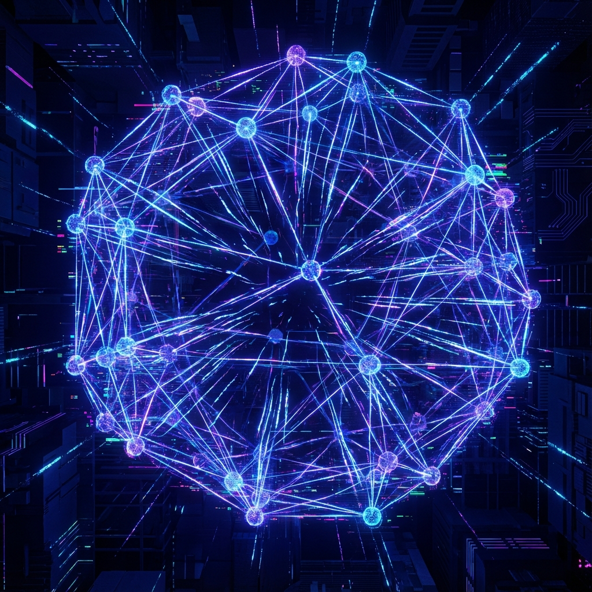
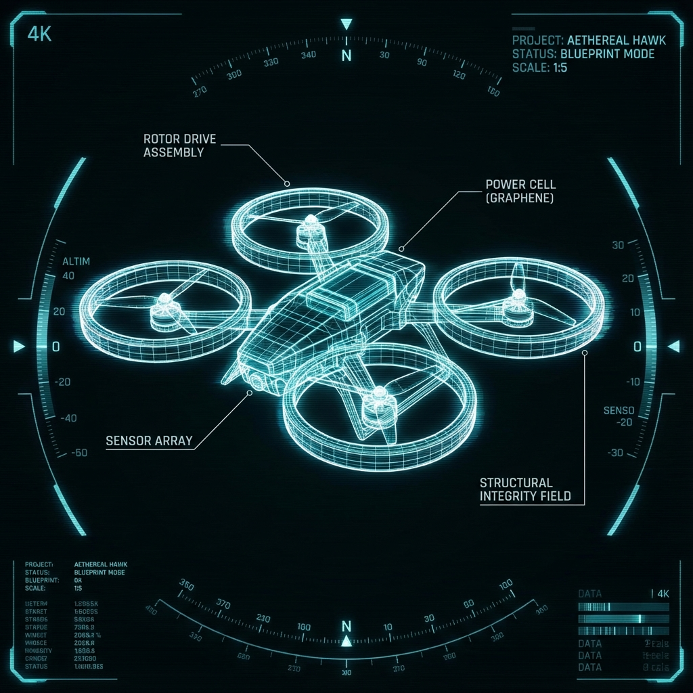
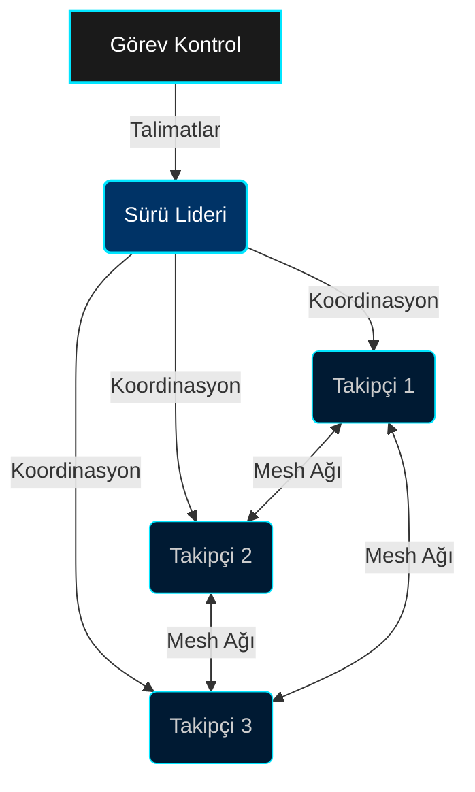
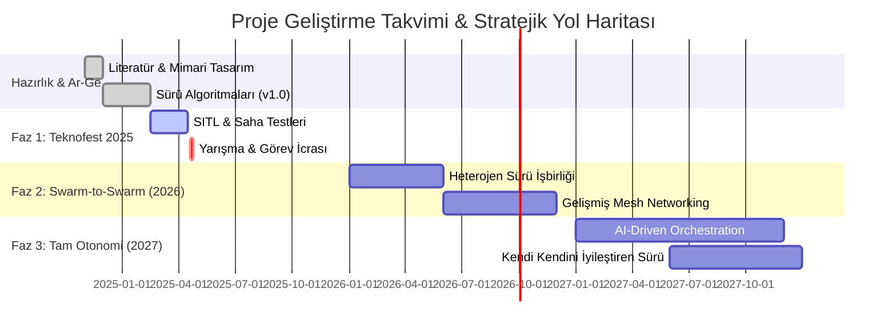

<div align="center">

# 🚁 TEKNOFEST SÜRÜ ZEKASI KOMUTA MERKEZİ
### Sürü İHA (Swarm UAV) Yarışması 2025


[](LICENSE)
[](https://github.com/bahattinyunus/teknofest_suru_iha)
[](https://docs.ros.org/en/humble/)
[](https://gazebosim.org/)
[](Dockerfile)

</div>

---

## 🌍 Küresel Sürü Zekası Ekosistemi
**"Dünyadaki Benzer Yarışmalar, Araştırma Laboratuvarları ve Açık Kaynak Projeler"**

Bu proje, küresel sürü robotatiği topluluğunun bir parçasıdır. Aşağıda, dünya çapındaki önemli kaynaklar kategorize edilerek listelenmiştir:

### 🏆 Prestijli Yarışmalar (Global Competitions)
| Yarışma / Organizasyon | Ülke / Bölge | GitHub Repo / Kaynak Kod |
| :--- | :--- | :--- |
| **MBZIRC Maritime Grand Challenge** | BAE | 🔗 [osrf/mbzirc](https://github.com/osrf/mbzirc) |
| **DARPA OFFSET (Swarm Experiment)** | ABD | 🔗 [niwcpac/mole](https://github.com/niwcpac/mole) |
| **IARC (International Aerial Robotics)** | Küresel | 🔗 [ICRS/IARC](https://github.com/ICRS/IARC) |
| **IMAV (Int. Micro Air Vehicle)** | Küresel | 🔗 [imav2022_nanocopter](https://github.com/tristandijkstra/imav2022) |
| **Swarm-UAV Competition** | Küresel | 🔗 [okantorun/Swarm-UAV](https://github.com/okantorun/Swarm-UAV) |
| **Swarm-Rescue (Search & Rescue)** | Küresel | 🔗 [ArkhamKnightGPC/drone-swarm-psc](https://github.com/ArkhamKnightGPC/drone-swarm-psc) |
| **CopterHack (Swarm-in-Blocks)** | Küresel | 🔗 [swarm-in-blocks](https://github.com/intelligent-soft-robotics/swarm-in-blocks) |

### 🔬 Akademik Araştırma Laboratuvarları (Research Labs)
| Laboratuvar / Proje | Kurum | Odak Alanı / Repo |
| :--- | :--- | :--- |
| **GRASP Lab** | UPenn | 🔗 [Multi-Robot Systems](https://github.com/grasp-irl) |
| **HeRoLab** | University of Georgia | 🔗 [heroswarmv2](https://github.com/herolab-uga/heroswarmv2) |
| **Swarm Lab** | UC Berkeley | 🔗 [Open Source Swarms](https://theswarmlab.com/) |
| **Marine Robotics Group** | MIT | 🔗 [The Thoroughbreds](https://github.com/MarineRoboticsGroup/SwarmRobot) |

### 💻 Açık Kaynak Sürü Yazılımları (Open Source Software)
| Proje İsmi | Tip | GitHub Link |
| :--- | :--- | :--- |
| **Awesome Swarm Drones** | Kürasyon | 🔗 [awesome-swarm-drones](https://github.com/awesomelistsio/awesome-swarm-drones) |
| **SwarmJS** | Simülatör | 🔗 [m-abdulhak/SwarmJS](https://github.com/m-abdulhak/SwarmJS) |
| **pyswarming** | Araç Seti | 🔗 [mrsonandrade/pyswarming](https://github.com/mrsonandrade/pyswarming) |
| **RoboMaster TT Swarm** | SDK / Driver | 🔗 [tianbot/rmtt_ros](https://github.com/tianbot/rmtt_ros) |
| **Crazyflie Firmware** | Firmware | 🔗 [bitcraze/crazyflie-firmware](https://github.com/bitcraze/crazyflie-firmware) |

### 📊 Teknik Karşılaştırma ve Rakip Analizi (Technical Benchmarking)
Sürü sistemleri, kullanım amacı ve teknoloji yığınına göre üç ana segmente ayrılmaktadır:

| Özellik | **Düşük Maliyetli / Eğitim** (Tello/RoboMaster) | **Yüksek Hassasiyetli / Ar-Ge** (Crazyflie/Crazyswarm) | **Endüstriyel / Karmaşık Görev** (PX4/MAVSDK) |
| :--- | :--- | :--- | :--- |
| **Donanım Platformu** | DJI Tello Talent (ESP32) | Bitcraze Crazyflie (STM32) | Pixhawk / Custom UAV |
| **Lokalizasyon** | ToF Sinyal / Wi-Fi | Motion Capture / Lighthouse | GPS / RTK / Vision-based |
| **Kontrol Mimarisi** | Merkezi (Station Mode) | Merkezi/Dağıtık (ROS) | Dağıtık (MAVLink/DDS) |
| **Simülasyon** | Gazebo / DroneBlocks | Crazyswarm Simulator | Gazebo / AirSim / SITL |
| **Öne Çıkan Gücü** | Kolay Kurulum / Blok Kodlama | İç Mekan Hassasiyeti (mm bazlı) | Ölçeklenebilirlik / Dış Mekan |

### 💡 Yeni Nesil Sürü Algoritmaları (SOTA Algorithms)
Rakiplerin ve global projelerin kullandığı en güncel Sürü Zekası yaklaşımları:

1.  **Bio-inspired Flocking**: Reynolds' Boids (Ayrılma, Hizalanma, Birleşme) algoritmalarının gelişmiş versiyonları.
2.  **Decentralized Coordination (MANET)**: Merkezi bir lider olmadan, İHA'lar arası doğrudan veri alışverişi (Mesh Net).
3.  **Autonomous Reallocation**: Bir İHA devre dışı kaldığında, sürünün otomatik olarak formasyonunu ve görevini güncellemesi.
4.  **Neural Swarm Networks**: Karmaşık çevresel engellerden kaçınmak için derin pekiştirmeli öğrenme (DRL) tabanlı navigasyon.
5.  **Stigmergy-based Search**: Böceklerin feromon bırakma davranışından esinlenen alan tarama algoritmaları.

### 🎯 Global Standartlar ve Performans Metrikleri (KPIs)
Projemiz, **DARPA OFFSET** ve **MBZIRC** gibi üst düzey yarışmaların belirlediği global başarı kriterleri ile uyumlu olarak geliştirilmektedir:

| Metrik Grubu | KPI Tanımı | Hedef / Standart |
| :--- | :--- | :--- |
| **Operasyonel Verim** | **Exploration Ratio (Alan Tarama)** | %95+ kapsama kapasitesi |
| **Sürü Dayanıklılığı** | **Robustness (Sağlamlık)** | %25 araç kaybında dahi görev devamlılığı |
| **Hız ve Yanıt** | **Convergence Time** | Görev hedefine kilitlenme süresinin optimizasyonu |
| **İletişim** | **Bandwidth Efficiency** | Minimum veri yükü ile maksimum koordinasyon |
| **Otonomi** | **Decision Latency** | Dinamik engellere karşı <500ms tepki süresi |

### 🌍 Global Hizalanma (International Alignment)
- **Framework Uyumluluğu**: ROS 2 ve MAVLink standartlarında tam uyumluluk.
- **Modülerlik**: DARPA'nın "Agile Sprints" metodolojisine benzer hızlı prototipleme mimarisi.
- **Denial-Resilience**: GNSS-denied (GPS'siz) ortamlarda otonom navigasyon hedefleri.

### 📐 Matematiksel Temeller (Mathematical Foundations)
Sürü koordinasyonu, grafik teorisi ve dinamik sistemlerin birleşimine dayanır:

1.  **Laplacian Konsensüs**: İHA'lar arası durum (konum/hız) anlaşması:
    $$\dot{x}_i = - \sum_{j \in N_i} a_{ij} (x_i - x_j)$$
    *Burada $L = D - A$ (Laplacian Matrisi), sistemin yakınsama hızını ve kararlılığını belirler.*

2.  **Yapay Potansiyel Alanları (APF)**:
    - **Cezbedici Güç ($U_{att}$)**: Hedefe yönelim.
    - **İtici Güç ($U_{rep}$)**: Engel ve İHA arası çarpışma önleme.
    $$F_{total} = -\nabla U_{att} - \nabla U_{rep}$$

### 🛡️ Siber-Fiziksel Güvenlik (Cyber-Physical Security)
Elektronik Harp (EW) koşullarında sürünün operasyonel sürekliliği için uygulanan stratejiler:

- **GNSS Spoofing Tespiti**: GPS verisi ile IMU/Görsel Odometri verilerinin tutarlılık kontrolü ($L_2$ norm analizi).
- **Adaptive Frequency Hopping**: Jamming (karıştırma) tespit edildiğinde dinamik kanal değişimi.
- **Anomaly-based IDS**: Sürü içindeki "malicious" (ele geçirilmiş) düğümlerin, konsensüs dışı hareketlerinden otomatik tespiti.

### 📡 Haberleşme Mimarisi: MAVLink 2 vs DDS
Sistemimiz, hibrit bir haberleşme katmanı kullanmaktadır:

| Özellik | **MAVLink 2** | **ROS 2 (DDS)** |
| :--- | :--- | :--- |
| **Kullanım** | Telemetri & Düşük Seviye Komut | Dağıtık İşlem & Sensör Paylaşımı |
| **Güvenlik** | Message Signing (HMAC-SHA256) | TLS/DTLS Encryption |
| **Verimlilik** | Yüksek (Minimal Overhead) | Esnek (High Throughput) |
| **Kritiklik** | Real-time Kontrol Döngüsü | Üst Seviye Görev Planlama |

### 📈 Sürdürülebilirlik & İş Modeli (Business Model)
Projemiz sadece teknik bir başarı değil, aynı zamanda ticarileşme potansiyeli yüksek bir girişimdir:

#### **SWOT Analizi**
| **Güçlü Yönler (S)** | **Zayıf Yönler (W)** |
| :--- | :--- |
| Hibrit haberleşme katmanı (MAVLink+DDS) | Yüksek donanım maliyetleri |
| Gelişmiş siber-güvenlik protokolleri | GPS bağımlılığı (şimdilik) |
| **Fırsatlar (O)** | **Tehditler (T)** |
| Teknofest Girişim Programı desteği | Hızlı teknolojik eskime |
| Genişleyen otonom tarım ve lojistik pazarı | Değişen UAV regülasyonları |

#### **Değer Önerisi (Value Proposition)**
- **Decentralized Reliability**: Tek bir İHA kaybında dahi operasyonu durdurmayan otonom yapı.
- **Security-First**: Sinyal karıştırma ve sahteciliğe karşı entegre savunma.
- **Scalable Framework**: 10'dan 100'e kadar İHA'yı destekleyen esnek mimari.

---


## 🌐 Görev Tanımı
**"Uçuşta Birlik, Sayılarda Zeka"**

Bu depo, **Teknofest Sürü İHA Yarışması** için tasarlanmış **Elit Sürü Zekası Sistemi**ni barındırır. Otonom drone koordinasyonu, formasyon uçuşu ve görev icrası için gelişmiş merkeziyetsiz algoritmalar uygular.

### 🧠 Nöral Sürü Ağı
Sistemimiz, biyolojik sürü davranışlarını taklit eden yapay sinir ağları ile güçlendirilmiştir. Her bir İHA, çevresini algılar ve sürünün geri kalanıyla gerçek zamanlı veri paylaşır.



---

Her bir sürü elemanı, yüksek manevra kabiliyetine sahip, sensör füzyonu ile donatılmış özel bir İHA prototipidir.

| Bileşen | Model / Teknik Özellik | Rol / Görev |
| :--- | :--- | :--- |
| **Uçuş Kontrolcü** | Orange Cube+ (OrangeBox) | Real-time stabilizasyon & MAVLink |
| **Tamamlayıcı Bilgisayar** | NVIDIA Jetson Orin Nano | Sürü zekası, SLAM & Obje Tespiti |
| **Haberleşme Modülü** | Herelink Blue / RFD900x | Uzun menzilli Mesh veri linki |
| **Konumlandırma** | Here3+ RTK GPS / Optical Flow | Santimetrik hassasiyette konumlandırma |
| **Güç Sistemi** | 4S/6S LiPo + T-Motor Ecosystem | Endüstriyel verimlilik & güç yönetimi |
| **Sensör Füzyonu** | RPLIDAR A3 + Depth Camera | Dinamik engel kaçınma & 3D Haritalama |



---

## 🏗️ Sistem Mimarisi: KOVAN (THE HIVE)

Sistem, düğüm arızalarına ve dinamik çevresel değişikliklere karşı dayanıklı, **Merkeziyetsiz Lider-Takipçi** mimarisi üzerinde çalışır.



### 🔹 Çekirdek Modüller
| Modül | Tanım | Protokol | Durum |
| :--- | :--- | :--- | :--- |
| **İşlem Birimi** | `src/swarm_core` | `MAVLink/DDS` | 🟢 **AKTİF** |
| **Görev Modları** | `BOIDS / SEARCH` | `Dinamik` | 🟢 **AKTİF** |
| **Simülasyon** | `src/swarm_simulation` | `Gazebo/SITL` | 🟢 **AKTİF** |
| **Telemetri Kaydı** | `JSON Logger` | `Otonom` | 🟢 **AKTİF** |
| **Görev Analizi** | `analyze_mission.py` | `Post-Process` | 🟢 **AKTİF** |
| **CI/CD Hattı** | `GitHub Actions` | `Lint/Test` | 🟢 **AKTİF** |

---

Projenin gelişim süreci ve gelecek hedefleri aşağıdadır.



---

## 🛠️ Teknolojik Cephanelik

**Komuta Merkezi**, hassasiyet ve güvenilirliği sağlamak için son teknoloji bir yığın kullanır.

- **İşletim Sistemi**: Ubuntu 22.04 LTS (Jammy Jellyfish) / Windows 11 WSL2
- **Ara Katman**: ROS 2 Humble Hawksbill
- **Simülasyon**: Gazebo Garden / Classic
- **Uçuş Kontrol**: PX4 Autopilot / ArduPilot
- **Konteynerizasyon**: Docker & Docker Compose
- **Dil**: Python 3.10+, C++17

---

## 🚀 Kurulum Protokolleri

### ⚡ Hızlı Başlangıç (Docker)
Sürü Simülasyonunu konteynerize edilmiş bir ortamda başlatın:

```bash
# Depoyu klonlayın
git clone https://github.com/bahattinyunus/teknofest_suru_iha.git

# Komuta Merkezine girin
cd teknofest_suru_iha

# Sürüyü konuşlandırın
docker-compose up --build
```

### 🔧 Manuel Kurulum
Yerel dağıtım için gerekli bağımlılıklar:
1. **ROS 2 Humble** yükleyin.
2. **Gazebo Simulator** yükleyin.
3. Python bağımlılıklarını yükleyin: `pip install -r requirements.txt`

```bash
# Çalışma alanını derleyin
colcon build --symlink-install

# Ortamı kaynak gösterin
source install/setup.bash

# Sürü Düğümünü başlatın
ros2 launch swarm_simulation swarm_world.launch.py
```

### 🖥️ Headless Simülasyon (Sunucu Tipi)
Grafik arayüzü olmayan sunucularda veya CI hatlarında çalıştırmak için:
```bash
ros2 launch swarm_simulation swarm_world.launch.py gui:=false
```

### 📊 Görev Analizi (Post-Mission Analysis)
Görev sırasında toplanan verileri analiz etmek için:
```bash
python3 src/swarm_core/swarm_core/analyze_mission.py <log_dosyasi>.json
```
*Bu araç, toplam kat edilen mesafe, ortalama hız ve sürü yoğunluğu gibi kritik verileri sağlar.*

### 🛰️ Görev Modları (Mission Modes)
Sürü, farklı görev profilleri arasında dinamik olarak geçiş yapabilir:
- **BOIDS**: Ayrılma, Hizalanma ve Birleşme bazlı sürü koordinasyonu.
- **SEARCH**: Arama-Kurtarma görevleri için Arşimet Spirali tabanlı alan tarama.

*Mod değiştirmek için ROS 2 parametresini kullanın:*
`ros2 param set /commander mission_mode SEARCH`

---

## 👨‍✈️ Amiral & Mimar

<div align="center">

| **Bahattin Yunus Çetin** |
| :---: |
| **BT Mimarı | Trabzon, Türkiye** |
| 🎓 *Sürü Zekası Ağının Vizyoneri* |
| 🔗 [GitHub](https://github.com/bahattinyunus) • [LinkedIn](https://linkedin.com/in/bahattinyunus) |

</div>

---

## 🤝 Sürüye Katıl
Kovan her zaman genişliyor. **Kolektif Zeka**ya katkıda bulunmak istiyorsanız, lütfen protokollerimize bakın.

- **[CONTRIBUTING.md](CONTRIBUTING.md)**: Kod gönderme protokolü.
- **[CODE_OF_CONDUCT.md](CODE_OF_CONDUCT.md)**: Etkileşim kuralları.

---

<div align="center">

*"Bütün, parçaların toplamından daha büyüktür."*
**© 2025 Teknofest Sürü İHA Takımı. Tüm Sistemler Çevrimiçi.**


</div>
<p align="center">
  
</p>
